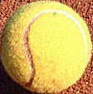
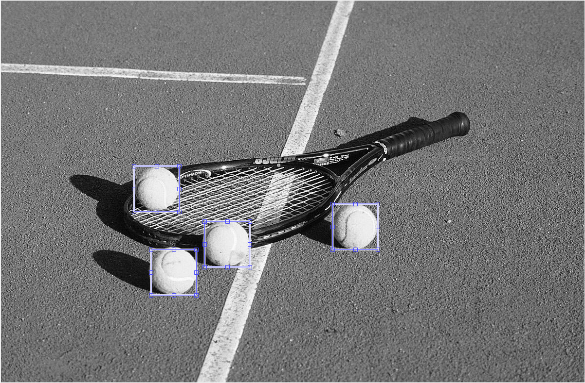

# object-detection-
object/pattern  detection using simple histogram 

Step 1:
Give the input image in which you want to detect the pattern/ object

step 2:
Give the pattern or object you want to detect

step3:
Run the main file

step4:
output is ready :p

